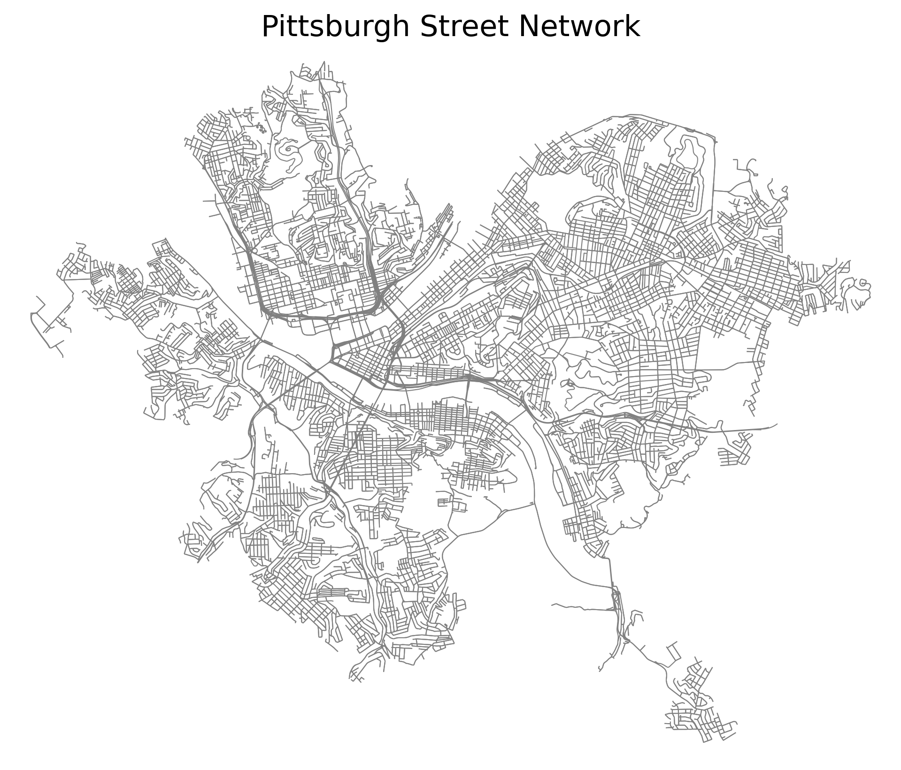

# Pittsburgh Street Slope Visualization Project

This project analyzes and visualizes **street slopes** in **Pittsburgh, Pennsylvania** to identify truck-suitable streets under slope constraints. The workflow includes downloading road network data, retrieving elevation data, calculating slopes, and visualizing results using **interactive maps**.

---

## **Key Features**

1. **Street Network Data**:  
   Download and process road networks from OpenStreetMap.

2. **Elevation Analysis**:  
   Retrieve elevation data for street start and end points using the TessaDEM API.

3. **Slope Calculation**:  
   Calculate slope percentages for each road segment.

4. **Threshold Filtering**:  
   Generate slope-constrained datasets for thresholds ranging from 1% to 40%.

5. **Interactive Maps**:  
   Visualize filtered streets dynamically using Folium maps.

---

## **Data Workflow**

1. **Street Network Retrieval**:  
   - Download the street network for **Pittsburgh** and save it as a `GraphML` file using `osmnx`.

2. **Elevation Data**:  
   - Retrieve elevation data for start and end points of each street segment using the **TessaDEM API**.

3. **Slope Calculation**:  
   The slope percentage for each street segment is calculated as follows:

   **Slope Percentage** = (Elevation Change / Street Length) × 100


4. **Threshold Filtering**:  
   - Filter streets based on absolute slope percentages from **1% to 40%**.
   - Generate separate CSV files for each threshold.

5. **Map Visualization**:  
   - Create interactive **Folium maps** to visualize streets that meet slope constraints.

---

## **Project Structure**

The project repository is organized as follows:

```plaintext
Pittsburgh_Street_Map/
│
├── pittsburgh_street_network.png        # Overview chart of Pittsburgh's street network
├── pittsburgh_street_slopes.csv         # Original processed slope data
├── slope_thresholds/                    # Filtered slope data (1% - 40%)
│   ├── pittsburgh_street_slopes_threshold_1.csv
│   ├── pittsburgh_street_slopes_threshold_2.csv
│   ├── ... (continues up to threshold_40)
│
├── preloaded_maps/                      # HTML maps for thresholds
│   ├── slope_map_threshold_1.html
│   ├── slope_map_threshold_2.html
│   ├── ... (continues up to threshold_40)
│
├── Pitts_Map.py                         # Streamlit app to visualize preloaded maps
├── Pitts_Street_Slope.py                # Script to process slope data
├── requirements.txt                     # Python dependencies
└── README.md                            # Project documentation
```
## **Visualization**

### **1. Pittsburgh Street Network Overview**

The image below shows the **Pittsburgh street network** used for slope analysis. The network is processed to calculate elevation changes and slopes for each street segment.



---

### **2. Slope-Constrained Maps**

This project generates **interactive maps** that visualize streets meeting slope thresholds from **1% to 40%**. Streets are color-coded based on their **slope percentage**:

- **Green**: Low slope  
- **Yellow**: Moderate slope  
- **Red**: High slope  

Each threshold map highlights streets where the **absolute slope percentage** is below a specific value.

#### Example Map (Threshold ≤ 10%)

To view the map for streets with slopes **≤ 10%**, open the following file:

preloaded_maps/slope_map_threshold_10.html


Alternatively, use the Streamlit app to explore maps interactively.

---

### **3. Slope-Constrained Shortest Path**

Using the Streamlit app, you can calculate the **shortest path** between two locations under slope constraints. Streets are filtered to exclude those with slopes above the specified threshold.

#### Example Workflow:

1. Input the **start location** (e.g., *Carnegie Mellon University*).
2. Input the **end location** (e.g., *6105 Spirit Street*).
3. Specify the **slope threshold** (e.g., **10%**).

The app will display the **shortest truck-suitable path** on a map.

---

### **Color Coding for Slope Visualization**

The slopes are visualized using a **color gradient** created with `folium.LinearColormap`:

- **Green**: Represents the **lowest slopes**.
- **Yellow**: Represents **moderate slopes**.
- **Red**: Represents the **highest slopes**.

The colors are scaled **dynamically** based on the minimum and maximum slope values in the dataset. The gradient ensures a smooth transition between colors as slope values increase.

---

| **Color**     | **Meaning**               | **Description**                          |
|---------------|---------------------------|------------------------------------------|
| **Green**     | Low Slope                 | Represents streets with the **smallest slopes** (close to `vmin`). |
| **Yellow**    | Moderate Slope            | Represents streets with **mid-range slopes**. |
| **Red**       | High Slope                | Represents streets with the **steepest slopes** (close to `vmax`). |

---

**Note**:  
- `vmin` and `vmax` are dynamically calculated from the dataset as the minimum and maximum slope values.  
- If the slope values are identical, the range is slightly adjusted to avoid errors.


### **Example Outputs**

- **Slope-Constrained Map (Threshold ≤ 10%)**:  
  

- **Slope-Constrained Shortest Path**:  
  The map highlights the shortest path that satisfies the slope constraint.


